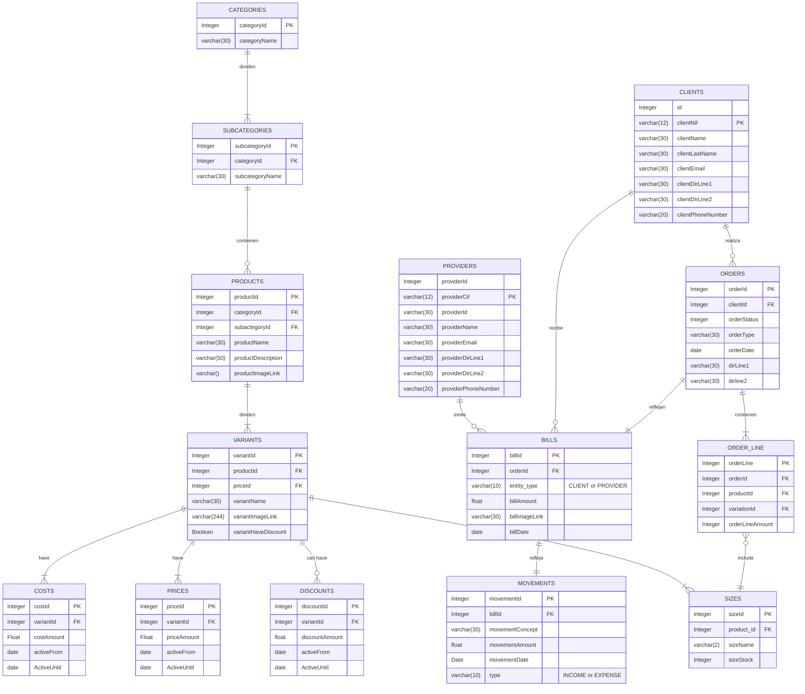

```mermaid
erDiagram

  CATEGORIES{
        Integer categoryId PK
        varchar(30) categoryName
    }

    SUBCATEGORIES{
        Integer subcategoryId PK
        Integer categoryId FK
        varchar(30) subcategoryName
    }

        PRODUCTS {
        Integer productId PK
        Integer categoryId FK
        Integer subactegoryId FK
        varchar(30) productName
        varchar(50) productDescription
        varchar() productImageLink


    }

        VARIANTS{
        Integer variantId PK
        Integer productId FK
        Integer priceId FK
        varchar(30) variantName
        varchar(244) variantImageLink
        Boolean variantHaveDiscount
    }

      SIZES {
        Integer sizeId PK
        Integer product_id FK
        varchar(2) sizeName
        Integer sizeStock
    }


    PRICES {
        Integer priceId  PK
        Integer variantId FK
        Float priceAmount
        date activeFrom
        date ActiveUntil
    }

    COSTS {
        Integer costId  PK
        Integer variantId FK
        Float costAmount
        date activeFrom
        date ActiveUntil
    }


    DISCOUNTS{
        Integer discountId PK
        Integer variantId FK
        float discountAmount
        date activeFrom
        date ActiveUntil
    }

     ORDERS {
        Integer orderId PK
        Integer clientId FK
        Integer orderStatus
        varchar(30) orderType
        date orderDate
        varchar(30) dirLine1
        varchar(30) dirline2
    }

    ORDER_LINE {
        Integer orderLine PK
        Integer orderId FK
        Integer productId FK
        Integer variationId FK
        Integer orderLineAmount
    }


    CLIENTS {
        Integer id
        varchar(12) clientNif PK
        varchar(30) clientName
        varchar(30) clientLastName
        varchar(30) clientEmail
        varchar(30) clientDirLine1
        varchar(30) clientDirLine2
        varchar(20) clientPhoneNumber
    }
      PROVIDERS {
        Integer providerId
        varchar(12) providerCif PK
        varchar(30) providerId
        varchar(30) providerName
        varchar(30) providerEmail
        varchar(30) providerDirLine1
        varchar(30) providerDirLine2
        varchar(20) providerPhoneNumber
    }

    BILLS {
        Integer billId PK
        Integer orderId FK
        varchar(10) entity_type "CLIENT or PROVIDER"
        float   billAmount
        varchar(30) billImageLink
        date billDate
    }

    MOVEMENTS {
        Integer movementId PK
        Integer billId FK
        varchar(30) movementConcept
        float movementAmount
        Date movementDate
        varchar(10) type "INCOME or EXPENSE"
    }


    CLIENTS ||--o{ ORDERS : "realiza"
    PROVIDERS ||--o{ BILLS : "emite"
    CLIENTS ||--o{ BILLS : "recibe"
    ORDERS ||--|| BILLS : "reflejan"
    ORDERS ||--|{ ORDER_LINE : "contienen"
    BILLS ||--|| MOVEMENTS : "refleja"

    CATEGORIES ||--|{ SUBCATEGORIES : "dividen"
    SUBCATEGORIES ||--o{PRODUCTS : "contienen"
    VARIANTS ||--|{ SIZES : "contienen"
    PRODUCTS ||--|{ VARIANTS : "dividen"
    ORDER_LINE }o--|| SIZES : "include"
    VARIANTS ||--o{ DISCOUNTS : "can have"
    VARIANTS ||--|{ PRICES : "have"
    VARIANTS ||--|{ COSTS : "have"
```
