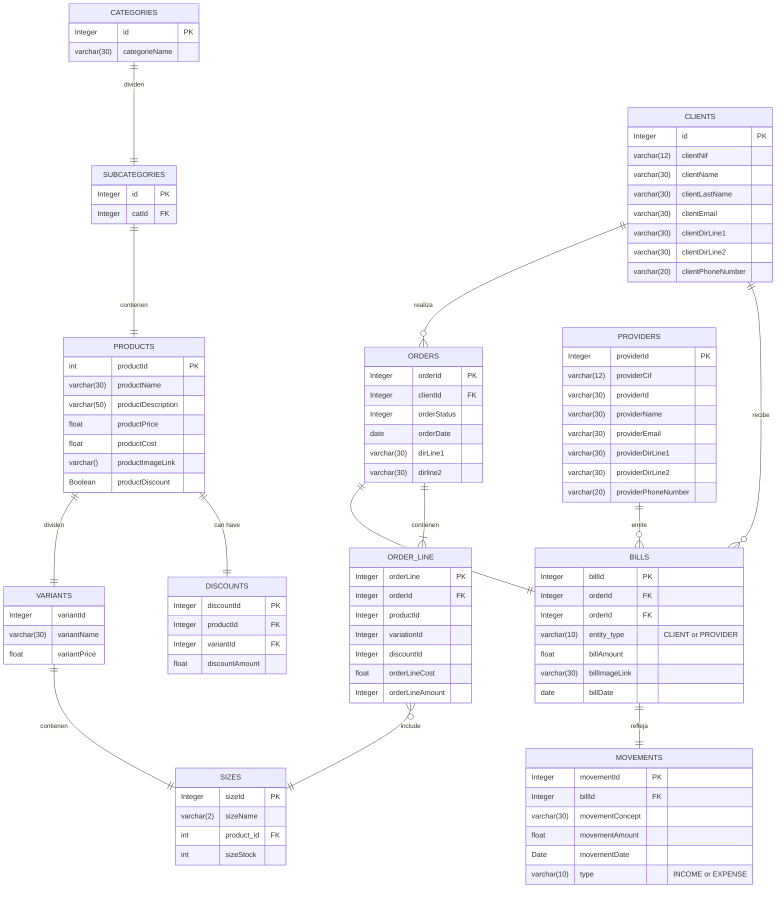

```mermaid
erDiagram

  CATEGORIES{
        Integer id PK
        varchar(30) categorieName
    }

    SUBCATEGORIES{
        Integer id PK
        Integer catId FK
    }

        PRODUCTS {
        int productId PK
        varchar(30) productName
        varchar(50) productDescription
        float productPrice
        float productCost
        varchar() productImageLink
        Boolean productDiscount

    }

        VARIANTS{
             Integer variantId
             varchar(30) variantName
             float variantPrice

        }

        SIZES {
        Integer sizeId PK
        varchar(2) sizeName
        int product_id FK
        int sizeStock
    }


    DISCOUNTS{
        Integer discountId PK
        Integer productId FK
        Integer variantId FK
        float discountAmount
    }


     ORDERS {
        Integer orderId PK
        Integer clientId FK
        Integer orderStatus
        date orderDate
        varchar(30) dirLine1
        varchar(30) dirline2
    }

    ORDER_LINE {
        Integer orderLine PK
        Integer orderId FK
        Integer productId
        Integer variationId
        Integer discountId
        float   orderLineCost
        Integer orderLineAmount
    }


    CLIENTS {
        Integer id PK
        varchar(12) clientNif
        varchar(30) clientName
        varchar(30) clientLastName
        varchar(30) clientEmail
        varchar(30) clientDirLine1
        varchar(30) clientDirLine2
        varchar(20) clientPhoneNumber
    }
      PROVIDERS {
        Integer providerId PK
        varchar(12) providerCif
        varchar(30) providerId
        varchar(30) providerName
        varchar(30) providerEmail
        varchar(30) providerDirLine1
        varchar(30) providerDirLine2
        varchar(20) providerPhoneNumber
    }


    BILLS {
        Integer billId PK
        Integer orderId FK
        Integer orderId FK
        varchar(10) entity_type "CLIENT or PROVIDER"
        float   billAmount
        varchar(30) billImageLink
        date billDate
    }

    MOVEMENTS {
        Integer movementId PK
        Integer billId FK
        varchar(30) movementConcept
        float movementAmount
        Date movementDate
        varchar(10) type "INCOME or EXPENSE"
    }


    CLIENTS ||--o{ ORDERS : "realiza"
    PROVIDERS ||--o{ BILLS : "emite"
    CLIENTS ||--o{ BILLS : "recibe"
    ORDERS ||--|| BILLS : "reflejan"
    ORDERS ||--|{ ORDER_LINE : "contienen"
    BILLS ||--|| MOVEMENTS : "refleja"

    CATEGORIES ||--|| SUBCATEGORIES : "dividen"
    SUBCATEGORIES ||--||PRODUCTS : "contienen"
    VARIANTS ||--|| SIZES : "contienen"
    PRODUCTS ||--|| VARIANTS : "dividen"
    ORDER_LINE }o--|| SIZES : "include"
    PRODUCTS ||--|| DISCOUNTS : "can have"

```
